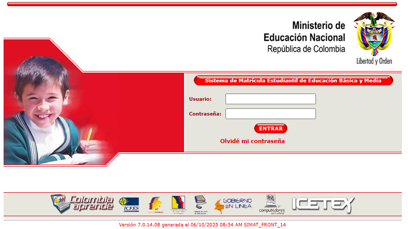

# Proyecto de IA Aplicada: Predicción de Educación Primaria en Niños con Autismo

Este repositorio contiene el desarrollo del proyecto de Inteligencia Artificial Aplicada de la Maestría, enfocado en la **Predicción de la Educación Primaria en niños con Autismo** en la etapa escolar, utilizando la base de datos del SIMAT (Sistema de Matrícula Estudiantil de Educación Básica y Media) del año 2025.

## 🎯 Descripción del Proyecto

El objetivo principal de este proyecto es aplicar técnicas de Ciencia de Datos e Inteligencia Artificial para analizar y predecir trayectorias educativas en la educación primaria de estudiantes diagnosticados con autismo. Buscamos identificar patrones y factores clave que influyen en su proceso de matrícula y permanencia, utilizando como fuente principal los registros anonimizados del SIMAT.

---

## 👨‍💻 Integrantes del Grupo

Este proyecto está siendo desarrollado por los siguientes alumnos de la Maestría:

* Edwin Yepes
* Cristian Quebrada
* Ruben Dario Sabogal

---

## 📓 Cuadernos del Proyecto (Notebooks)

El análisis y desarrollo de los modelos se encuentran documentados en los siguientes cuadernos:

* **Cuaderno 1 (Colab):** [Análisis Exploratorio y Preprocesamiento de Datos](https://colab.research.google.com/drive/1rUkTJ5FIrboe7dDwUMuLb76V952u38q3?usp=sharing)
* **Cuaderno 2 (Colab):** [Desarrollo y Evaluación de Modelos Predictivos](https://colab.research.google.com/drive/1KhpMslnJGm7HGy2X7283wjlAE9kbvd7I?usp=sharing)
* **Cuaderno 3 (GitHub):** [Notebook SIMAT](https://github.com/rubenesticesi/aprendizajeautomatico1/blob/master/simat.ipynb)

---

## Repository

Este proyecto se encuentra alojado en el repositorio:
[https://github.com/rubenesticesi/-taller-colaborativo](https://github.com/rubenesticesi/-taller-colaborativo)
